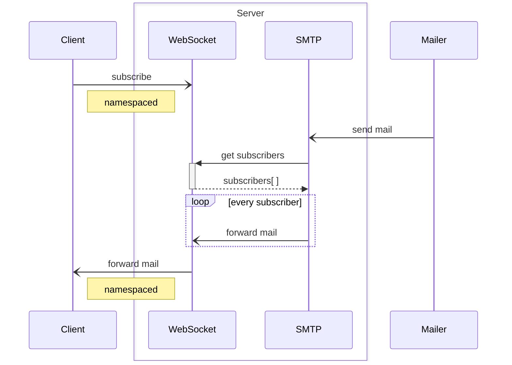

# Playwright Mail Tester

## Purpose

Provide simple, fast, local-first e2e email testing with full parallel support.

## Design



## Demo

```sh
yarn && yarn test
```

## Built with

- [mailparser](https://github.com/nodemailer/mailparser)
- [nanoid](https://github.com/ai/nanoid)
- [smtp-server](https://github.com/nodemailer/smtp-server)
- [ws](https://github.com/websockets/ws)
